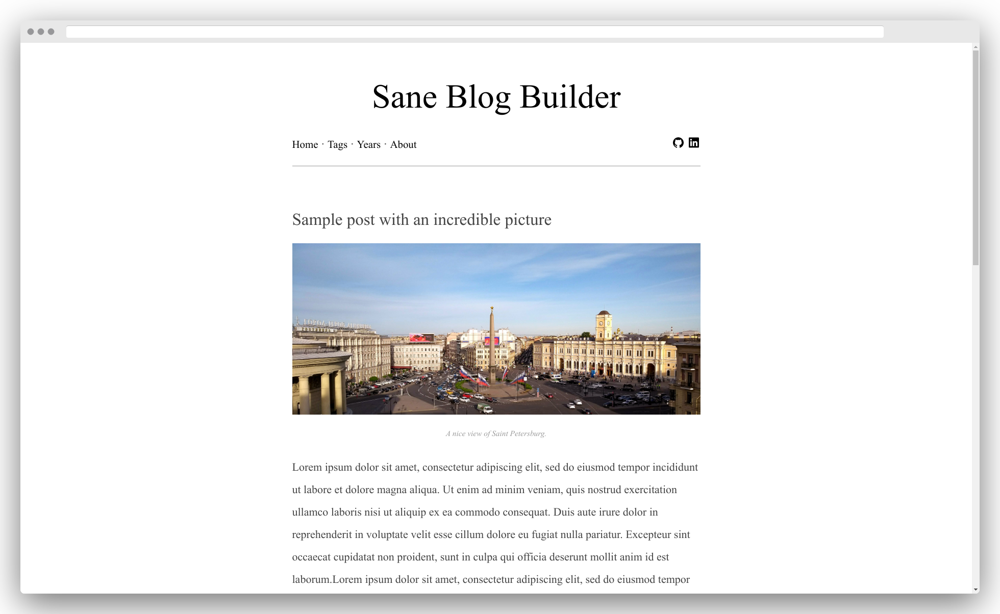

# Sane blog builder

This is a static blog generator. Click [here](https://lbrito1.github.io/sane-blog-builder/) for a live demo.

There are approximately 1 trillion other projects using an [unfathomable amount of different libraries](https://www.staticgen.com/) that do more or less the same as this humble thing.

This uses Ruby (more specifically, the excellent [Nanoc](https://nanoc.ws) lib) to generate static HTML pages from Markdown or other HTML files.

[Pure CSS](https://purecss.io/) is sparingly used to help with layouts and such. I recommend that you don't look at the CSS, just trust that it works most times.

## Features
* Zero amount of Javascript;
* Basic blogging functionalities (a page that lists all posts, a page to show the actual post, tagging etc);
* Syntax highlighting;
* Readable on any device known to mankind (actually I tested only on my monitor and smartphone);
* A page that shows posts by year;
* A page that shows posts by tag;
* A helper for images;
* A rake task that helps set up a new post;
* Small: the entire output of this skeleton is like 100KB (images excluded);
* Has stupid emojis 🎨 (okay that's just your browser);
* That's about it.

## Deployment instructions

There's a [convenience script](deploy.sh) for Github Pages deployment.

## Why?
Why not?

Okay, here's a longer answer: (to-do)
